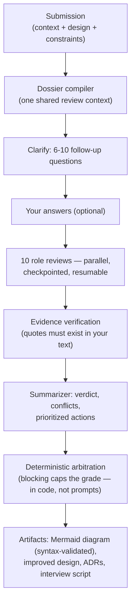

<div align="center">

# ArchCoach

**Your AI architecture review board.**

Submit a system design. Six AI reviewers grill it, grade it, and hand you back
a review report, a Mermaid architecture diagram, ADRs, and an interview script.

[简体中文](./README.zh-CN.md) · [Quick Start](#quick-start) · [How It Works](#how-it-works) · [Contributing](./CONTRIBUTING.md)


</div>

## What it is / isn't

| ArchCoach is | ArchCoach is not |
|---|---|
| An AI review board that interrogates your design before judging it | A chatbot that compliments whatever you paste |
| A system-design interview trainer with built-in scenarios | An online course platform |
| Fully self-hosted — runs 100% locally with Ollama, zero API key | A SaaS (v1 is single-user, one `docker compose up`) |
| A working reference for LLM engineering: structured output, evidence verification, deterministic orchestration, cost logging | A LangChain demo |

## The review board

| Reviewer | Watches for |
|---|---|
| 首席架构师 Chief Architect | Overall soundness, complexity vs. team size, constraint coverage |
| 技术架构师 Tech Architect | Module boundaries, technology choices and their justification |
| 数据库专家 Database Expert | Data models, transactions, consistency, reconciliation |
| SRE | Capacity math, degradation paths, observability, blast radius |
| 安全专家 Security Expert | AuthZ, anti-abuse, data protection, audit |
| 面试官 Interviewer | Whether you can *explain* the trade-offs out loud |

Every finding must quote your original text (`evidence`). Quotes that can't be
located in your submission are flagged as unverified and de-emphasized —
the anti-hallucination gate. A blocking verdict from any reviewer caps the
overall grade at C: averaging cannot dilute a launch blocker.

## Quick start

```bash
git clone https://github.com/jindawn/archcoach && cd archcoach
cp .env.example .env   # add any one provider key — or use local Ollama with no key
docker compose up
open http://localhost:3000
```

Click **载入示例 (Load Example)**, answer a couple of follow-up questions, and
watch the board light up.

### Multi-user deployment

The default `LOCAL_MODE=true` is for one trusted local user. Before exposing
ArchCoach to other people, set `LOCAL_MODE=false` and run `pnpm db:migrate`.
Users can then register with email and a password; submissions and review
reports are visible only to their owner. Existing local-mode submissions stay
unowned and are intentionally hidden in authenticated mode.

Optionally set `GITHUB_CLIENT_ID` and `GITHUB_CLIENT_SECRET` to enable GitHub
login. Configure the OAuth App callback as `https://your-host/api/auth/github/callback`.

### Supported models

| Provider | Config | Notes |
|---|---|---|
| DeepSeek | `LLM_PROVIDER=deepseek` | Great quality/cost for reviews |
| OpenAI / Anthropic | `LLM_PROVIDER=openai\|anthropic` | Best artifact quality |
| OpenRouter | `LLM_PROVIDER=openrouter` | Any model, one key |
| **Ollama (local)** | `LLM_PROVIDER=ollama` | Zero key, fully private. **qwen3:8b or better recommended** — ArchCoach uses Ollama's constrained decoding (`json_schema`), so even small models emit valid structured output, but diagram quality needs qwen3-class models |

## How it works



Design choices worth stealing:

- **Deterministic orchestration, no agent framework.** The workflow is a
  ~150-line state machine. Each step persists, so a crashed review resumes
  without re-billing completed roles.
- **LLM summarizes, code decides.** Scores and grade caps are computed
  deterministically; the model never grades itself.
- **Prompts are files.** Every prompt lives in [`/prompts`](./prompts) with a
  version field, reviewed via PR like any other code.
- **Every call is logged** — tokens, latency, cost, prompt version — and each
  report shows exactly what it cost to produce.

## Screenshots

| Clarify | Report |
|---|---|
|  |  |

## Use from Claude Code / Cursor (MCP)

ArchCoach ships an MCP server, so your coding agent can submit a design and
read the board's verdict — and, crucially, **answer the board's clarifying
questions from your actual codebase** before the review starts.

```bash
# with an ArchCoach instance running (docker compose up):
claude mcp add archcoach -- node /path/to/archcoach/mcp/archcoach-mcp.mjs
```

Tools: `get_clarifying_questions` → `start_review` → `get_review_report` →
`get_artifact`, plus one-shot `review_architecture` and
`list_training_scenarios`. Point `ARCHCOACH_URL` at a non-default instance.
Smoke check: `node mcp/smoke.mjs`.

## Development

```bash
pnpm install
docker compose up postgres -d
cp .env.example .env        # DATABASE_URL already points at localhost:5433
pnpm db:migrate && pnpm dev
```

`pnpm test` (78 unit/integration tests, mocked LLM) · `pnpm eval` (real-model
quality gates: evidence rate, blocking detection, good/bad score ordering,
diagram parse rate).

## Roadmap

- **Shipped** — authentication, GitHub OAuth, 10-role board, training recommendations,
  durable review worker, team review rooms, and team knowledge retrieval
- **Shipped** — owner/member roles and seven-day email-bound invitation links
- **Shipped** — optional OpenAI-compatible semantic embeddings with lexical fallback
- **Next** — outbound invitation email delivery

## Contributing

The lowest-friction contribution is a new training scenario — one markdown
file, no code. See [CONTRIBUTING.md](./CONTRIBUTING.md).

## License

[Apache-2.0](./LICENSE)
