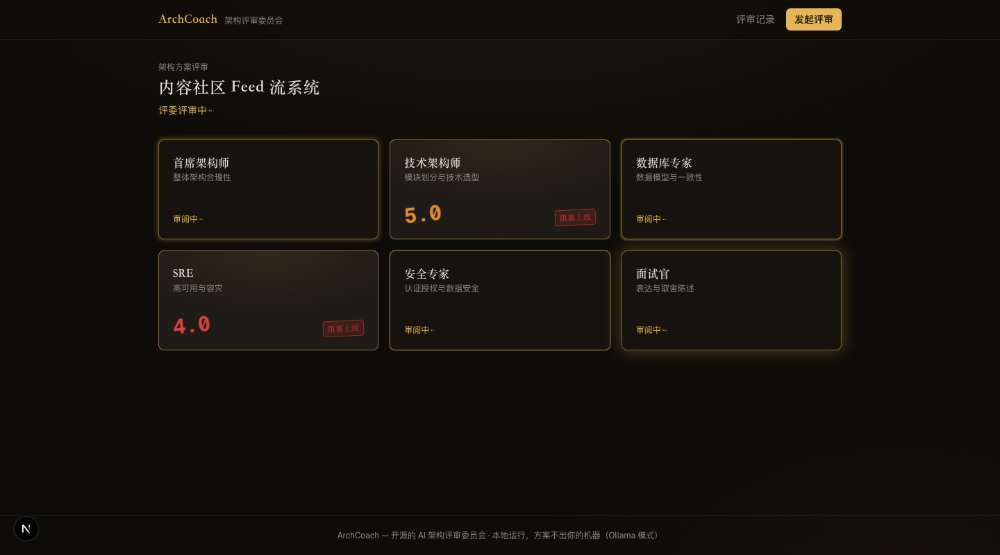
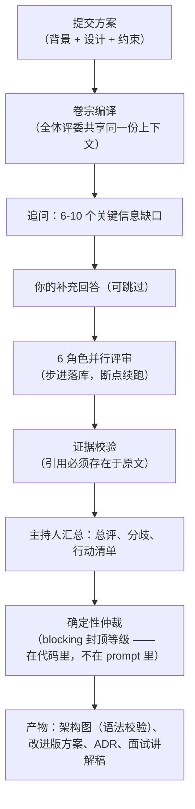
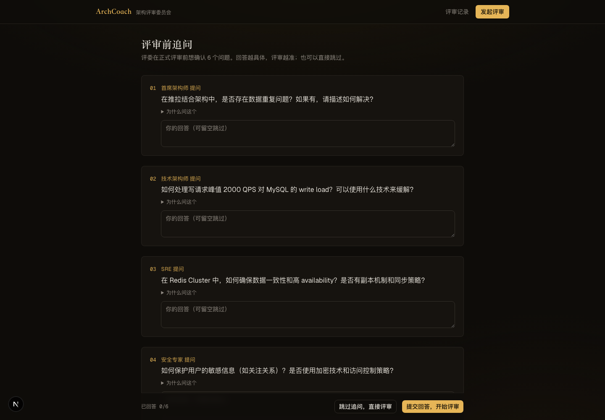
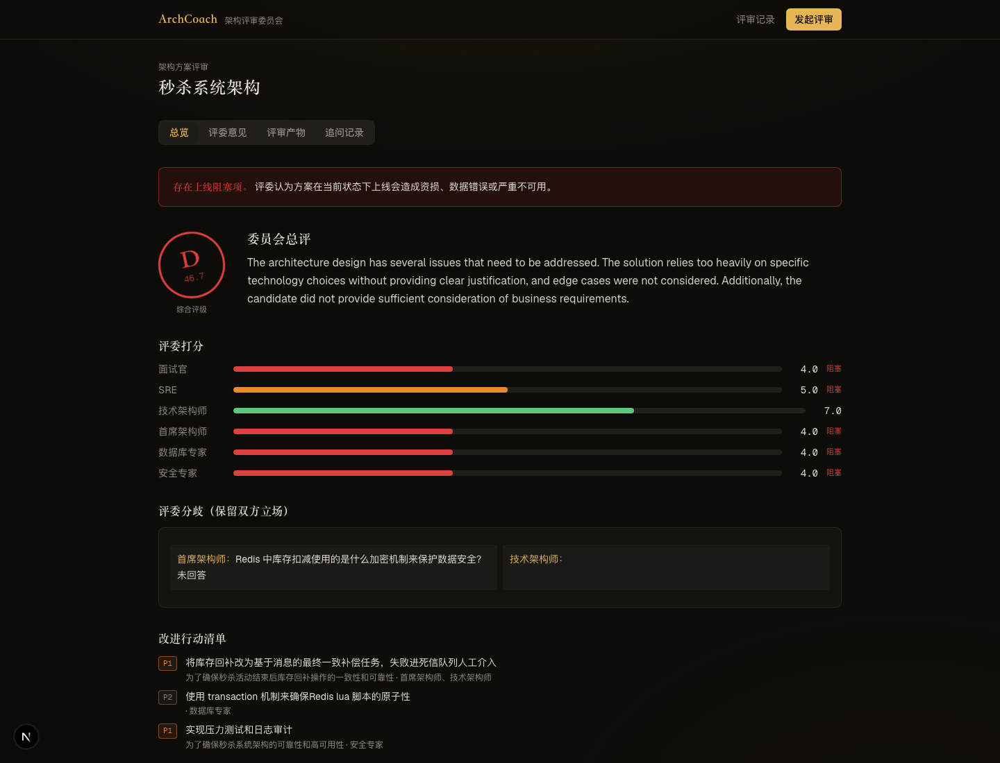

<div align="center">

# ArchCoach

**你的 AI 架构评审委员会。**

提交一份架构方案，6 位 AI 评委先追问、再评审、后打分，
最终交还给你：评审报告、Mermaid 架构图、改进版方案、ADR 决策记录、面试讲解稿。

[English](./README.md) · [快速开始](#快速开始) · [工作原理](#工作原理) · [参与贡献](./CONTRIBUTING.md)



</div>

## 它是什么 / 不是什么

| 是 | 不是 |
|---|---|
| 会先追问你、再给结论的 AI 评审委员会 | 夸你方案写得好的聊天机器人 |
| 带内置训练题的系统设计面试陪练 | 在线课程平台 |
| 完全自托管，配合 Ollama 可 100% 本地运行、零 API key | SaaS（v1 是单用户单机工具） |
| 一份可参考的 LLM 工程实现：结构化输出、证据校验、确定性编排、成本审计 | LangChain 演示项目 |

## 评审委员会

| 评委 | 关注什么 |
|---|---|
| 首席架构师 | 整体合理性、复杂度与团队规模是否匹配、约束是否被回应 |
| 技术架构师 | 模块边界、选型依据 |
| 数据库专家 | 数据模型、事务、一致性、对账 |
| SRE | 容量推算、降级预案、可观测性、爆炸半径 |
| 安全专家 | 认证授权、防刷风控、数据安全、审计 |
| 面试官 | 你能不能把取舍讲清楚 |

**每条评审意见都必须引用你方案的原文**（evidence 字段）。引用无法在原文中定位的意见会被标记为"未验证"并降权展示——这是防幻觉的闸门。任何一位评委给出"阻塞上线"判定，总评级最高只能是 C：平均分稀释不掉上线阻塞项，这条规则写在代码里而不是 prompt 里。

## 快速开始

```bash
git clone https://github.com/jindawn/archcoach && cd archcoach
cp .env.example .env   # 填任意一家模型的 key —— 或配置本地 Ollama 零 key 运行
docker compose up
open http://localhost:3000
```

点击**「载入示例（秒杀系统）」**，回答几个追问，然后看评审席逐个亮起。

### 多用户部署

默认的 `LOCAL_MODE=true` 仅适用于一位受信任的本地用户。准备让其他人访问前，
请设为 `LOCAL_MODE=false` 并执行 `pnpm db:migrate`。用户可使用邮箱和密码注册；
提交与评审报告仅对其所有者可见。此前在本地模式创建的无归属记录会在认证模式下隐藏。

### 支持的模型

| Provider | 配置 | 说明 |
|---|---|---|
| DeepSeek | `LLM_PROVIDER=deepseek` | 评审场景性价比最高 |
| OpenAI / Anthropic | `LLM_PROVIDER=openai\|anthropic` | 产物质量最佳 |
| OpenRouter | `LLM_PROVIDER=openrouter` | 一个 key 用所有模型 |
| **Ollama（本地）** | `LLM_PROVIDER=ollama` | 零 key、完全私有。**推荐 qwen3:8b 及以上**——ArchCoach 使用 Ollama 的约束解码（`json_schema`），小模型也能输出合法 JSON，但架构图质量需要 qwen3 级别的模型 |

## 工作原理



值得借鉴的设计决策：

- **确定性编排，不用 Agent 框架。** 工作流是约 150 行的状态机，每步落库，评审中断后续跑不会对已完成的角色重复计费。
- **LLM 负责汇总，代码负责裁决。** 分数与等级封顶由代码确定性计算，模型不给自己打分。
- **Prompt 即文件。** 所有 prompt 在 [`/prompts`](./prompts) 目录，带版本号，像代码一样走 PR 评审。
- **每次调用全量记录**——token、耗时、成本、prompt 版本，每份报告都标注它的生产成本。

## 截图

| 追问 | 报告 |
|---|---|
|  |  |

## 在 Claude Code / Cursor 中使用（MCP）

ArchCoach 内置 MCP server：让你的编码代理直接提交方案、读取评审结论——关键是，
**代理可以根据你的真实代码库回答评审委员会的追问**，再开始正式评审。

```bash
# 先启动 ArchCoach 实例（docker compose up），然后：
claude mcp add archcoach -- node /path/to/archcoach/mcp/archcoach-mcp.mjs
```

工具链：`get_clarifying_questions` → `start_review` → `get_review_report` →
`get_artifact`；另有一步式 `review_architecture` 与 `list_training_scenarios`。
非默认地址通过 `ARCHCOACH_URL` 指定。冒烟检查：`node mcp/smoke.mjs`。

## 本地开发

```bash
pnpm install
docker compose up postgres -d
cp .env.example .env        # DATABASE_URL 默认指向 localhost:5433
pnpm db:migrate && pnpm dev
```

`pnpm test`（78 个单测/集成测试，mock LLM）· `pnpm eval`（真实模型质量门：证据率、blocking 检出、好坏方案分数排序、图可解析率）。

## Roadmap

- **v1.1** — 多用户认证与更丰富的产物工作流
- **v1.2** — 完整 10 角色委员会、训练进度与推荐、任务队列
- **v2** — 团队评审室、企业知识 RAG

## 参与贡献

门槛最低的贡献方式：**添加一道训练题**——一个 markdown 文件，不用写代码。详见 [CONTRIBUTING.md](./CONTRIBUTING.md)。

## 协议

[Apache-2.0](./LICENSE)
